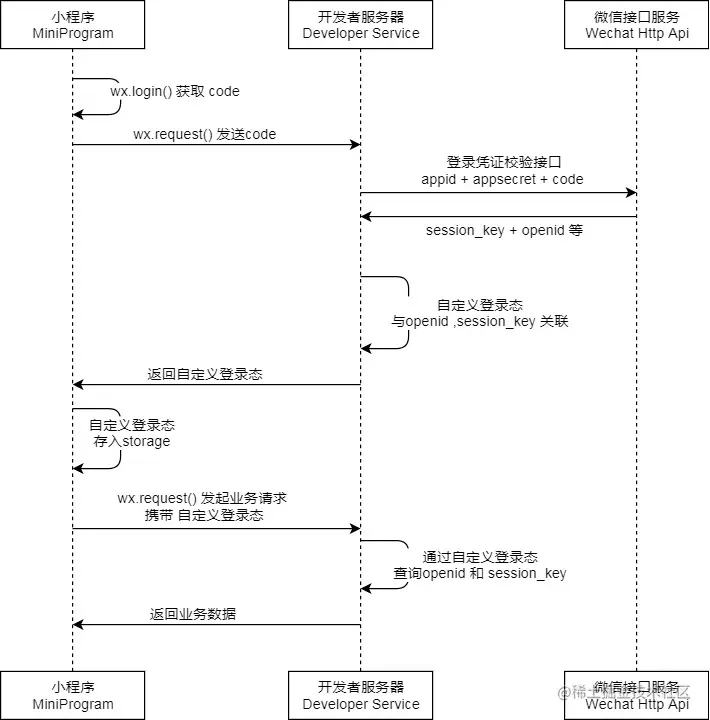

# 微信小程序登录和业务请求流程

## 流程说明

### 登录流程
1. 小程序调用 `wx.login()` 获取 code
2. 小程序将 code 发送给开发者服务器
3. 开发者服务器向微信接口服务验证登录凭证
4. 微信接口服务返回 session_key 和 openid
5. 开发者服务器生成自定义登录态
6. 小程序存储自定义登录态

### 业务请求流程
1. 小程序发送业务请求时携带自定义登录态
2. 开发者服务器根据自定义登录态查询用户信息
3. 返回业务数据给小程序
